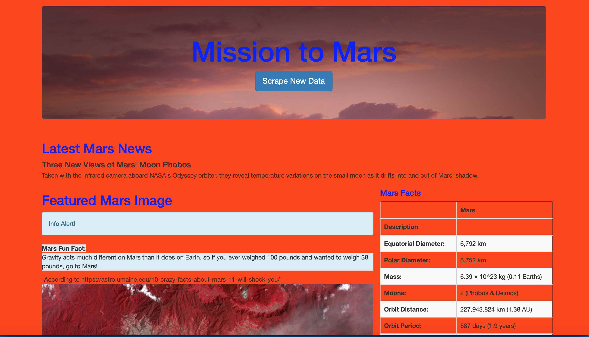

# Mission-to-Mars
Developing a website scraping data from Nasa's website which includes pictures and info about the planet Mars. For the challenge, I created a loop from which I used a similar structure as the module work and was able to render the four Mars hemispheres using the bootstrap syntax. This made it unnecessary to create an app route for the hemispheres as the previous routes already created encapsulated the loop that was created for the hemisphere implementation into the website. I was also able to add in a few alerts(

), random facts (

 structure with a <footer></footer> added), and a dropdown where the user of the website can pick among the four hemispheres as to what they thought their favorite was in order to make it more interactive (I utilized the <select></select> structure). I also was able to add a picture I scraped from the Nasa website and put it in my .jumbotron area where the <head> section is.

Check out my screenshotted Portfolio: https://github.com/mhvarner/Portfolio

